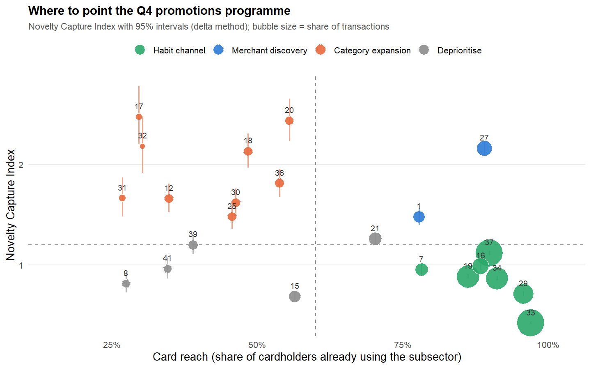
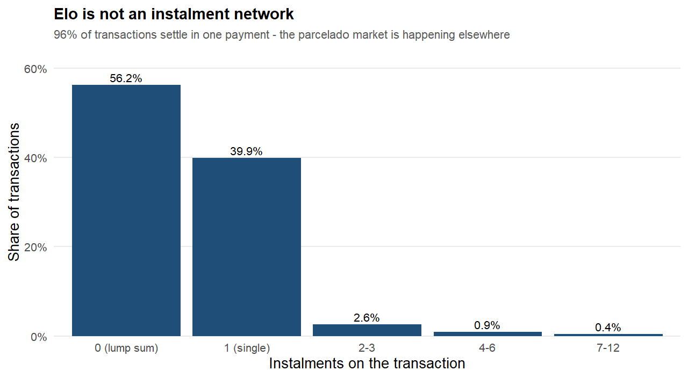
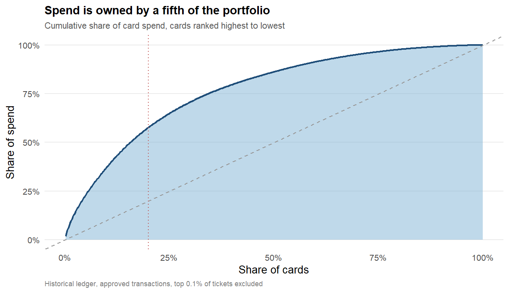
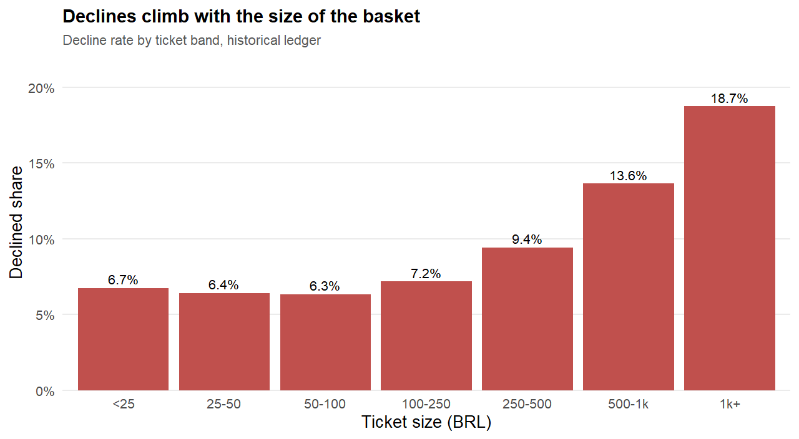
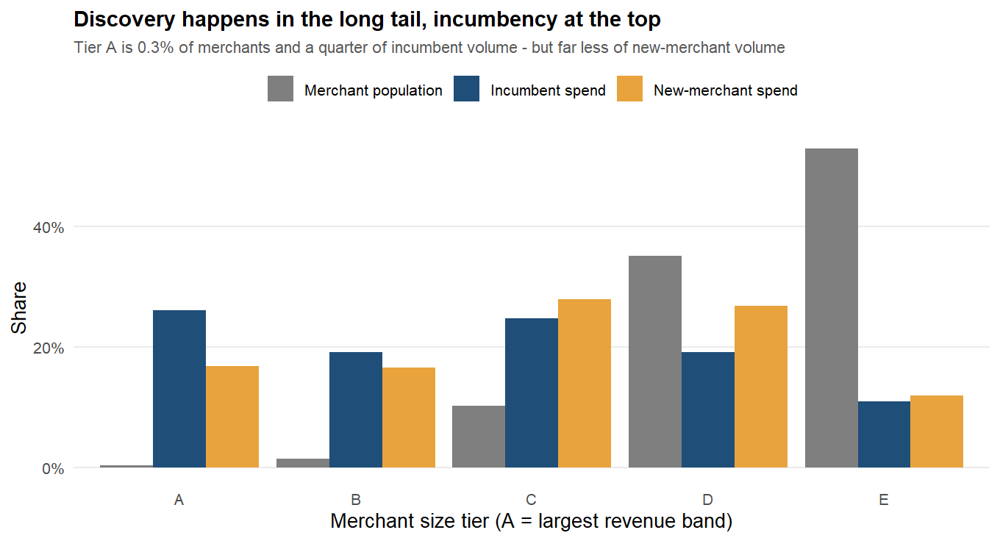

# What Kind of Payment Network Are We? — Elo Card Data Analysis


A data analysis project in **R**. It studies 200,000 card transactions and
334,000 merchant records from **Elo**, a large Brazilian payment card brand,
and turns them into a clear business story with practical recommendations for a
Board meeting.

**Main outputs:**

- 📊 **Full report** — [`Elo_Analysis.html`](Elo_Analysis.html) (built from [`Elo_Analysis.Rmd`](Elo_Analysis.Rmd))
- 🧮 **Standalone R script** — [`elo_analysis.R`](elo_analysis.R)
- 🎤 **Board presentation** — [`Elo.pptx`](Elo.pptx) (10 slides)

> **Tip:** GitHub shows HTML files as code. To read the report as a web page,
> download `Elo_Analysis.html` and open it in your browser, or turn on GitHub
> Pages (see [Viewing the report online](#viewing-the-report-online)).

---

## The problem

The case is set in May 2018. Elo runs a card network and a **promotions programme**,
where partner merchants offer discounts to Elo cardholders. For years, decisions
about which merchants and categories to promote were based on gut feeling.

The Board asked one question:

> *"Based on everything in this data, what kind of payment network are we, and
> what should that tell us about where to point the promotions programme in
> Quarter 4?"*

To answer it, I broke the big question into five smaller ones:

1. **Can we read the money?** The amounts in the data are scrambled (normalised).
2. **Who uses our cards?** Is spending spread out or concentrated?
3. **How is the network used?** Small everyday buys, or big purchases paid in instalments?
4. **What do the merchants look like?** Big chains or small shops?
5. **Where do people try new places?** This is exactly what a promotion is trying to cause.

---

## Key findings

| # | Finding | The number |
|---|---------|------------|
| 1 | Elo is an **everyday, small-ticket** network | Median purchase is about **R$35**; 63% of purchases are under R$50 |
| 2 | It is **not** an instalment network | **96%** of purchases are paid in one go |
| 3 | A small group of cards drives the money | Top 20% of cards make **58%** of all spending (Gini = 0.54) |
| 4 | Declines hide in one place | A risk flag (`category_1 = Y`) gives **4.3×** higher odds of a decline |
| 5 | Big merchants get habit, small merchants get discovery | The largest merchants (0.3% of all merchants) take 26% of regular spending but only 17% of spending at new places |
| 6 | People spend more when they try a new merchant | **R$118.70** at a new merchant vs **R$84.70** at a known one |
| 7 | Promotions are aimed at the wrong categories | "Discovery" categories create **2.35×** more first visits than "habit" categories |

**Bottom line:** stop giving discounts where people already shop out of habit.
Move that budget to categories and merchants where cardholders are actively
trying new places. Moving one third of the habit budget could bring about
**28,000 extra first visits**.

---

## Charts

**Where to point the Q4 promotions** — each bubble is a merchant category.
Categories high on the chart are where people discover new merchants.



<table>
  <tr>
    <td></td>
    <td></td>
  </tr>
  <tr>
    <td></td>
    <td></td>
  </tr>
</table>

All charts are in the [`figures/`](figures) folder.

---

## What I did, step by step

1. **Cleaned the data.** Removed 948,575 empty rows left over from an Excel
   export, dropped 63 duplicate merchant IDs, and fixed text values like `inf`
   in number columns.
2. **Turned scrambled amounts back into real money.** The `purchase_amount`
   column was normalised. I worked out the formula to convert it back to
   Brazilian Reais: `BRL = purchase_amount / 0.00150265 + 497.06`.
3. **Checked that conversion with Benford's Law.** Real money amounts follow a
   known pattern in their first digits. Our converted amounts pass this test.
4. **Profiled the cardholders.** Measured spending concentration, split cards
   into four groups, and checked how many cards are still active after 12 months.
5. **Studied how cards are used.** Instalments, time of day, and what drives a
   payment to be declined.
6. **Studied the merchants.** Size, health, and location compared with where
   the customers are.
7. **Built a targeting map.** Two new scores for each merchant category show
   where promotions create new customer relationships and where they only
   reward habits.
8. **Wrote recommendations** (eight in the report, the top five in the slides)
   and was honest about the limits of the data.

### Methods and techniques used

| Technique | What it was used for |
|-----------|----------------------|
| Data cleaning and auditing | Found and fixed hidden problems before analysis |
| Reverse-engineering a linear transform | Converted normalised values back to real currency |
| Benford's Law (MAD test) | Checked that the currency conversion is believable |
| Gini coefficient + bootstrap confidence interval | Measured how concentrated spending is |
| HHI (Herfindahl–Hirschman Index) | Measured market concentration of merchants and categories |
| Rule-based segmentation + k-means clustering | Grouped cardholders by behaviour |
| Cohort retention analysis | Measured how many cards stay active over time |
| Lapse index | Found cards that are going quiet, compared with their own normal rhythm |
| Chi-square test | Tested if instalments and declines are related |
| Logistic regression (odds ratios) | Found what drives a declined payment |
| Welch's t-test | Tested if new-merchant purchases really are bigger |
| Delta-method confidence intervals | Showed which categories are *really* discovery categories |
| Lift / affinity matrix | Found which customers to send each offer to |

---

## Project structure

```
.
├── Elo_Analysis.Rmd      # Full report (R Markdown) – the main analysis
├── Elo_Analysis.html     # The report, built from the .Rmd
├── elo_analysis.R        # Standalone script: prints key numbers and saves charts
├── prepare_data.R        # Builds the Data/ folder from the Kaggle download
├── Elo.pptx              # 10-slide Board presentation
├── figures/              # Charts made by elo_analysis.R
├── Data/                 # Input data (not included – see Data/README.md)
├── LICENSE
└── README.md
```

---

## How to run it

### 1. Install the tools

- [R](https://cran.r-project.org/) (version 4.0 or newer)
- [RStudio](https://posit.co/download/rstudio-desktop/) (recommended — it includes Pandoc, which is needed to build the HTML report)

The R packages (`dplyr`, `ggplot2`, `tidyr`, `scales`, `knitr`, `rmarkdown`)
are installed automatically the first time you run the code.
`data.table` is optional but makes loading the data about 10× faster.

### 2. Get the data

The data is **not** stored in this repository. It comes from the public Kaggle
competition [Elo Merchant Category Recommendation](https://www.kaggle.com/competitions/elo-merchant-category-recommendation/data).
Follow the steps in [`Data/README.md`](Data/README.md) — it takes about 5 minutes.

### 3. Run the analysis

From the project folder:

```bash
# Option A – quick run: prints the key numbers and saves charts to figures/
Rscript elo_analysis.R

# Option B – build the full HTML report
Rscript -e "rmarkdown::render('Elo_Analysis.Rmd')"
```

Or open `Elo_Analysis.Rmd` in RStudio and click **Knit**.

The quick script finishes in under a minute. The full report takes a few minutes.

---

## Viewing the report online

You can host the HTML report for free with GitHub Pages:

1. On GitHub, open the repository → **Settings** → **Pages**.
2. Under **Build and deployment**, choose **Deploy from a branch**,
   pick `main` and `/ (root)`, then **Save**.
3. After a minute, the report is live at
   `https://<your-username>.github.io/<repo-name>/Elo_Analysis.html`.

---

## Limitations

Being clear about the limits is part of a good analysis:

- **No loyalty-score file.** The card-level file with the loyalty score was not
  part of the export, so card value was rebuilt from behaviour.
- **Two different groups of cards.** The regular-spending file and the
  new-merchant file share only 16 cards, so the comparisons are at the
  portfolio level, not card by card.
- **A small panel.** The regular-spending file covers 463 cards, so confidence
  intervals are shown where they matter.
- **Anonymous data.** Categories are numbers (for example "subsector 27"), so
  someone inside Elo would need to put real names on them.
- **Correlation, not causation.** The targeting map shows where discovery
  already happens. A proper A/B (holdout) test is needed to prove a promotion
  *causes* new visits.

---

## What I learned

- **Check the data before analysing it.** 90% of the rows in one file were
  empty, and 99 extreme values were about to distort every average.
- **Speak the audience's language.** "The median ticket is −0.69" means
  nothing to a Board. "The median ticket is R$35" is a strategy.
- **Simple tables can answer big questions.** One frequency table (96% paid in
  one go) answered "what kind of network are we?"
- **Ratios tell more than totals.** By raw volume, the biggest category looked
  like the best place to promote. Compared with discovery and supply, it was
  the worst.
- **Test your own assumptions.** The currency formula was checked with a
  completely different method (Benford's Law) before it was trusted.

---

## Tools

**R** · **dplyr** · **tidyr** · **ggplot2** · **scales** · **knitr** ·
**R Markdown** · **data.table** · **PowerPoint**

---

## Contributors

- **Boddu Hima Venkata Ganesha Saisriram** — analysis, report and presentation

---

## License

This project is released under the [MIT License](LICENSE).

The Elo data belongs to its original owners and is **not** covered by this
license. Please follow the Kaggle competition rules when you download and use it.
